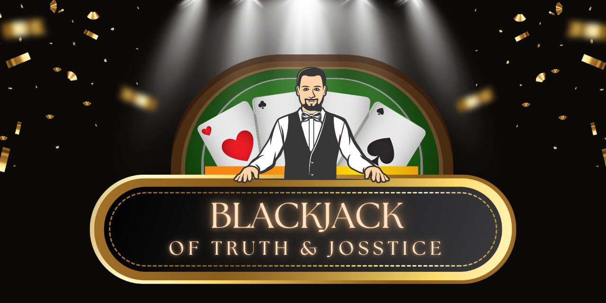

# Blackjack of Truth and Josstice!

---

## Project Overview

Welcome fellow alumni and fellow cohort members to **Blackjack of Truth and Josstice!**

This is my project of a Blackjack simulation developed as part of my DEV1001 - Assessment 2 at Coder Academy and represents my first Python project, and my **first coding project ever!**

This project was developed as a learning assessment, it showcases my foundational Python skills, understanding of ethical software design principles, and practical application of coding concepts to build a Command-Line Interface (CLI) gameplay experience.

**The key learning objectives for this project include:**
- Designing an interactive text-based user experiences through a CLI
- Applying Python programming fundamentals in a practical project-based context
- Develop functions to manage game logic flow and decision-making
- Utilise custom modules and third-party library packages effectively
- Practicing responsible software development with consideration of ethical design principles
- Handle persistent data storage using JSON and CSV files for tracking player progress and gameplay statistics

---

## Table of Contents

- [Blackjack of Truth and Josstice!](#blackjack-of-truth-and-josstice)
  - [Table of Contents](#table-of-contents)
  - [Project Overview](#project-overview)
  - [Getting Started](#getting-started)
    - [Installation Guide](./INSTALLATION.md)
    - [Usage Instructions](./USAGE_INSTRUCTIONS.md)
  - [Purpose of the App](#purpose-of-the-app)
  - [Usage Overview](#usage-overview)
    - [Disclaimer](#disclaimer)
    - [How Users Interact with the App](#how-users-interact-with-the-app)
  - [Features and Functionality of the App](#features-and-functionality-of-the-app)
  - [Dependencies: Third Party Packages and Licenses](#dependencies-third-party-packages-and-licenses)
  - [Ethical Considerations](#ethical-considerations)
    - [Australian Support Services](#australian-support-services)
  - [Privacy Policy](#privacy-policy)
  - [References and Resources](#references-and-resources)

---

## Getting Started

**Quick Links:**
[⇨ Go to Installation Guide](./INSTALLATION.md)
[⇨ Go to Usage Instructions](./USAGE_INSTRUCTIONS.md)

This project comes with a detailed step-by-step **[Installation Guide](./INSTALLATION.md)** to help you set up and run the application, including:
- Cloning the repository
- Setting up Python and dependencies
- Running the app in your terminal

After completing installation, follow the **[Usage Instructions](./USAGE_INSTRUCTIONS.md)** to learn how to:
- Navigate the Main Menu
- Select a table and play a game
- Understand game controls and tracking stats
- Save progress and exit the application

---

## Purpose of the App

This project was developed as part of a student learning assessment to design and build a (CLI) Python application.

The app simulates the classic card game **Blackjack**, providing an interactive and beginner-friendly environment for users to learn, play and practice gameplay strategies.

**The purpose of this Blackjack app is to allow players to:**
- Experience Blackjack gameplay using simple keyboard inputs for navigation and actions via CLI
- Learn basic house and gameplay rules to understand the flow of Blackjack gameplay
- Practice betting strategies and chip management in a **risk-free simulation environment where no real money is involved**

---

## Usage Overview

### Disclaimer

> ⚠️ **IMPORTANT NOTICE:**
>
> - This application is intended for **educational and personal entertainment purposes only**.
> - This application is intended for users **over the age of 18**.
> - It is a **non-commercial simulation** designed to demonstrate coding concepts and responsible software design.
> - **No real money is involved**, and it is not intended to promote or encourage gambling.
> - The project encourages **responsible gameplay** and discourages excessive or compulsive play by avoiding addictive mechanics and clearly communicating its purpose as an educational tool.

### How Users Interact with the App

The app provides a simple menu-driven interface where users can:
- Select and play at different table types
- Play Blackjack rounds against a dealer AI that follows house rules
- Manage bets, track chip counts and view player statistics (such as chips remaining, wins and losses)
- Experience the flow of a typical Blackjack session in a simulation-based environment

[⇨ Click here to view Usage Instructions](./USAGE_INSTRUCTIONS.md)

---

## Features and Functionality of the App

| **Feature** | **Description** |
|-------------|-----------------|
| **Blackjack Simulator** | There are multiple control flows and loops used to parse and create data, enabling the player to experience a simulation of gameplay. |
| **Menu-Driven Interface** | Simple CLI terminal menu to navigate game modes, view stats, and exit the game. |
| **House & Gameplay Rules** | In-app access to 'House Rules' and 'Gameplay Rules' for new players to understand how the app's Blackjack version works. |
| **Multiple Table Types** | Four types of tables to choose to play from which include: Low Rollers (200), Mid Rollers (500), High Rollers (1000) and No Limit tables. Each table adopts different rulesets and bet limits and have specific amounts of chips to be won. |
| **Gameplay Flow** | he game features multiple control flow structures to handle player bet amounts and game outcomes. Tables load with default chip pools. Players place chip bets, play hands against a dealer AI and their stats are updated after each round. |
| **Dealer AI Logic** | A basic AI logic is implemented for the dealer, allowing the dealer to make decisions (eg. hit/stand) based on simplified rules. At the end of each round, player and table stats are updated and saved to relevant JSON stat files. These stats track chip counts, wins and losses for player's progress across sessions. |
| **Custom ASCII Card Display** | layer and dealer cards are visualised using a custom ASCII card function, displaying them side-by-side in the terminal. Hands are generated and calculated using CSV files for card values and suits, ensuring fair and dynamic gameplay visuals. |
| **Player Statistics Tracking** | Tracks player's current chip count, total chips won and lost, total hands played and lost Stats persist between sessions via JSON files. |
| **Progress Saving & File Loading** | Player and table stats data is either initialised through a new game, or loaded from JSON files to continue and save progress. |
| **Data Management** | Player profiles and table statistics are saved in JSON files. These persist between sessions and can be updated after each play. |
| **Data Privacy by Design** | No sensitive user data is collected or shared. All game data is stored locally with [manual deletion instructions provided here](./USAGE_INSTRUCTIONS.md#data-management-and-privacy). |
| **Error Handling and Critical Files** | Custom error-handling methods have been built into the application to manage common user input errors and prevent crashes. While most scenarios are accounted for, some key combinations or edge cases may still trigger Python-native exceptions. Essential file `newtables_DONOTDELETE.json` is required for proper game functionality as it loads the predefined stats for each of the four types of tables. |

---

## Dependencies: Third Party Packages and Licenses

View the full list of dependencies and package details here: [Dependencies](./DEPENDENCIES.md)

**License Notes:**
*All libraries are used in accordance with their individual licenses. Colorama copyright information contained in this readme file in accordance with BSD license.*

*User data (Player Name) is only collected via input from the user, and is stored locally. No sensetive information is requested or stored either locally or online. No third parties have access to user stored data.*

---

## Ethical Considerations

<!-- IMPORTANT TO NOTE FOR THIS DEVELOPMENT PROJECT:
"Developers working on gambling simulations bear ethical responsibilities to minimise harm, comply with relevant laws, protect user data, and promote fair, transparent play. Referencing regulatory and academic guidance is essential to ensure that such projects do not inadvertently contribute to gambling-related harms or regulatory breaches." -->

As a developer of a simulated gambling application, I recognise the ethical responsibilities involved in minimising harm, promoting fair play and ensuring legal compliance. While this project is a non-commercial, educational simulation with no real money involved, future developments aim to align with responsible design principles and industry ethical standards to ensure best practices are followed.

Two globally recognised professional codes of ethics that guide responsible computing practices are:
1. [ACM Code of Ethics](https://www.acm.org/code-of-ethics)
2. [IEEE Code of Ethics](https://www.computer.org/education/code-of-ethics)

Both codes remind developers that their work should benefit society, avoid causing harm and create systems that are fair, honest and support the wellbeing of users.

**1. Responsible Design and Prevention of Harm**
- **Minimise Risk of Addiction (ACM 1.2 - Avoid Harm):**
    - Features that mimic addictive mechanics (eg. reward loops, rapid replay cycles, scoreboards) have been consciously avoided.
    - The current implementation uses a slow print integration to slow down gameplay, reducing the chance of rapid, compulsive replays.
    - Future updates may explore limit-of-play features to further minimise and discourage excessive gameplay sessions.

- **Transparent Communication (ACM 1.3 - Be Honest and Trustworthy):**
  - This readme document clearly communicates to users that the application is a simulation for educational and entertainment purposes and does not involve real money transactions or financial loss or gain.
  - Transparency is maintained to avoid misleading representations that could contribute to risky behaviours.

<!-- Research source: Simulated gambling environments can normalise betting behavior and increase the risk of problem gambling, even when no real money is involved. -->

**2. Legal and Regulatory Compliance**
- **Age Restrictions (ACM 1.2 - Avoid Harm / IEEE #5 - Improve Understanding of Technology):**
    - Future development will incorporate age verification systems to comply with legal requirements (eg. Australian Interactive Gambling Act) ensuring underage users cannot access gambling simulations.

<!-- Research source: Compliance with Local Laws:
Ensure the game does not violate online gambling regulations, such as those outlined in the Australian Interactive Gambling Act. Even simulated gambling may fall under regulatory scrutiny if it promotes betting or could be mistaken for real gambling.-->

**3. Data Privacy and Player Protection**
- **User Data Security (ACM 1.6 - Respect Privacy / IEEE #1 - Disclose Personal Gain Interests):**
    - Personal data is not collected or shared and no sensitive information to users are stored or collected.
    - User's player profile data files are stored locally on the user's device in the project's file `playerstats.json` with clear instructions for manual deletion [here](./USAGE_INSTRUCTIONS.md#data-management-and-privacy).
    - Any future implementation of user's player profiles will ensure robust authentication and encryption measures.

<!-- Research source: Applications should responsibly handle any personal or gameplay data, ensuring privacy and security. Persistent storage of statistics or profiles should not expose sensitive information. -->

**3.Promotion of Fair Play**
- **Algorithmic Fairness (ACM 1.4 - Be Fair and Take Action Not to Discriminate):**
    - The card dealing logic uses a genuine randomisation algorithm to ensure outcomes are unbiased and not rigged to favour the house.

<!-- Can probably consider including a documented logic (like flowshare) to show how functions use randomisation/ai to support fairness in gameplay. -->

<!-- Research source: Disclosure of Odds and Rules: Game rules, odds, and payout structures must be accessible and understandable to all users. Hidden mechanics or unclear rules undermine informed user choice. -->

**4. Social and Psychological Impact**
- **Mental Health Awareness (ACM 1.2 - Avoid Harm / IEEE #8 - Treat Fairly All Persons):**
    - While this application is not intended to be widely distributed or open-source, I acknowledge the potential influence of simulated gambling environments on user behaviour and mental wellbeing.
    - Recognising that simulated gambling environments can shape attitudes towards real gambling, the app promotes responsible engagement and provides resources for mental health and gambling support.
    - I encourage all users to engage responsibly and be mindful of the psychological impacts associated with gambling related activities (even in a simulated context).

> ⚠️ **IMPORTANT:**
> If you or someone you know is experiencing gambling related concerns or requires mental health support, please reach out to the following resources provided below.

### Australian Support Services

- Gambling Help Online (24/7 support) - https://www.gamblinghelponline.org.au
- Lifeline Australia (Crisis Support & Suicide Prevention) - 13 11 14 | https://www.lifeline.org.au
- Beyond Blue (Mental Health Support Services) - 1300 22 4636 | https://www.beyondblue.org.au
- Relationships Australia (Gambling Counselling & Family Support) - https://www.relationships.org.au

For additional resources and regulations, please consult local laws and guidelines relevant to gambling activities in your region.

<!-- Research source: Consider including resources or warnings about problem gambling and offer links to support services if the game is widely distributed.
Avoiding Social Harm: Developers should be aware that simulated gambling can influence attitudes towards real gambling, potentially leading to harmful behaviors over time.-->

---

## Privacy Policy

This privacy policy applies to the Blackjack of Truth and Josstice! app (hereby referred to as "Application") for Command Line Interface that was created by [Joss](https://github.com/truth-josstice) (hereby referred to as "Service Provider") as a Free service. This service is intended for use "AS IS".

**What information does the Application obtain and how is it used?**

The Application does not obtain any information when you download and use it. Registration is not required to use the Application.

**Does the Application collect precise real time location information of the device?**

This Application does not collect precise information about the location of your device.

**Do third parties see and/or have access to information obtained by the Application?**

Since the Application does not collect any information, no data is shared with third parties.

**What are my opt-out rights?**

You can stop all collection of information by the Application easily by uninstalling it. You may use the standard uninstall processes as may be available as part of your device.

**Children**

The Application is not used to knowingly solicit data from or market to children under the age of 13.

The Service Provider does not knowingly collect personally identifiable information from children. The Service Provider encourages all children to never submit any personally identifiable information through the Application and/or Services. The Service Provider encourage parents and legal guardians to monitor their children's Internet usage and to help enforce this Policy by instructing their children never to provide personally identifiable information through the Application and/or Services without their permission. If you have reason to believe that a child has provided personally identifiable information to the Service Provider through the Application and/or Services, please contact the Service Provider (16283@coderacademy.edu.au) so that they will be able to take the necessary actions. You must also be at least 16 years of age to consent to the processing of your personally identifiable information in your country (in some countries we may allow your parent or guardian to do so on your behalf).

**Security**

The Service Provider is concerned about safeguarding the confidentiality of your information. However, since the Application does not collect any information, there is no risk of your data being accessed by unauthorized individuals.

**Changes**

This Privacy Policy may be updated from time to time for any reason. The Service Provider will notify you of any changes to their Privacy Policy by updating this page with the new Privacy Policy. You are advised to consult this Privacy Policy regularly for any changes, as continued use is deemed approval of all changes.

This privacy policy is effective as of 2025-08-07

**Your Consent**

By using the Application, you are consenting to the processing of your information as set forth in this Privacy Policy now and as amended by the Service Provider.

**Contact Us**

If you have any questions regarding privacy while using the Application, or have questions about the practices, please contact the Service Provider via email at 16283@coderacademy.edu.au.

_This privacy policy page was generated by [App Privacy Policy Generator](https://app-privacy-policy-generator.nisrulz.com/) and modified to suit this particular application in accordance with recommendations outlined by the [Australian Privacy Principles](https://www.oaic.gov.au/privacy/australian-privacy-principles/australian-privacy-principles-quick-reference)._

---

## References and Resources

Ethical Considerations References:
1. [ACM Code of Ethics](https://www.acm.org/code-of-ethics)
2. [IEEE Code of Ethics](https://www.computer.org/education/code-of-ethics)
3. [ACMA Interactive Gambling Act Overview](https://www.acma.gov.au/about-interactive-gambling-act)
4. [Academic Analysis (TandF)](https://www.tandfonline.com/doi/full/10.1080/15256480.2025.2494575?src=exp-la)
5. [Parliamentary Report - Simulated Gambling](https://www.aph.gov.au/Parliamentary_Business/Committees/House/Social_Policy_and_Legal_Affairs/Onlinegamblingimpacts/Report/Chapter_6_-_Simulated_gambling_and_gambling-like_activities)

---

[⇧ Back to Top](#blackjack-of-truth-and-josstice)
